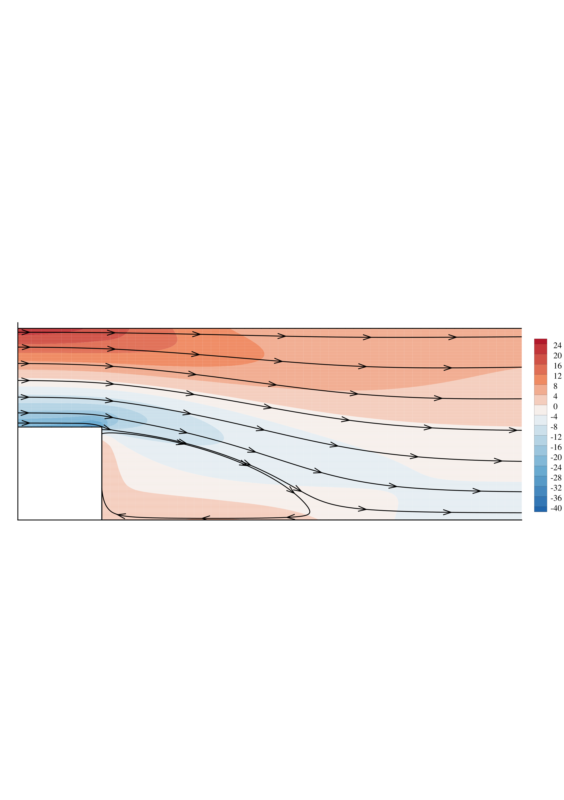
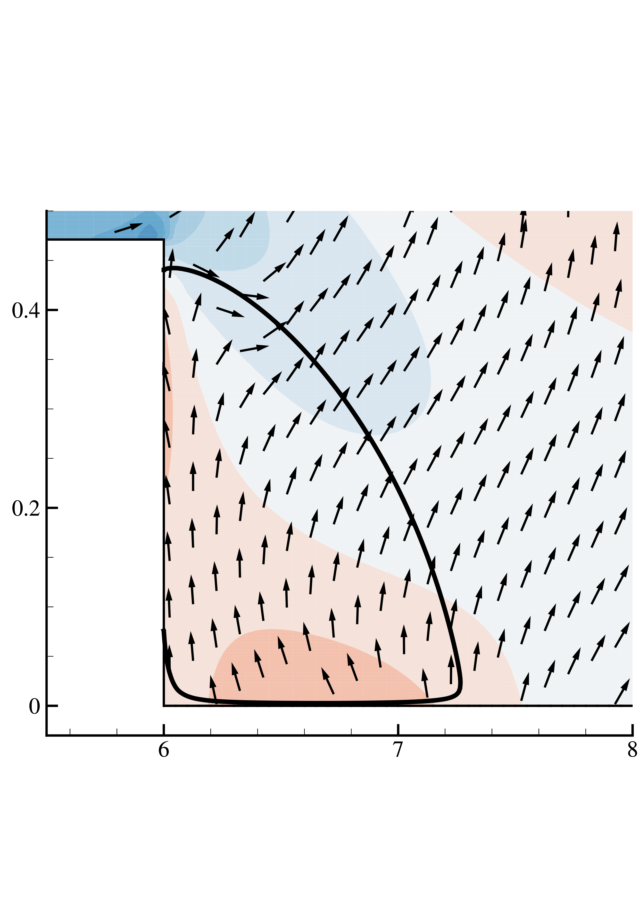
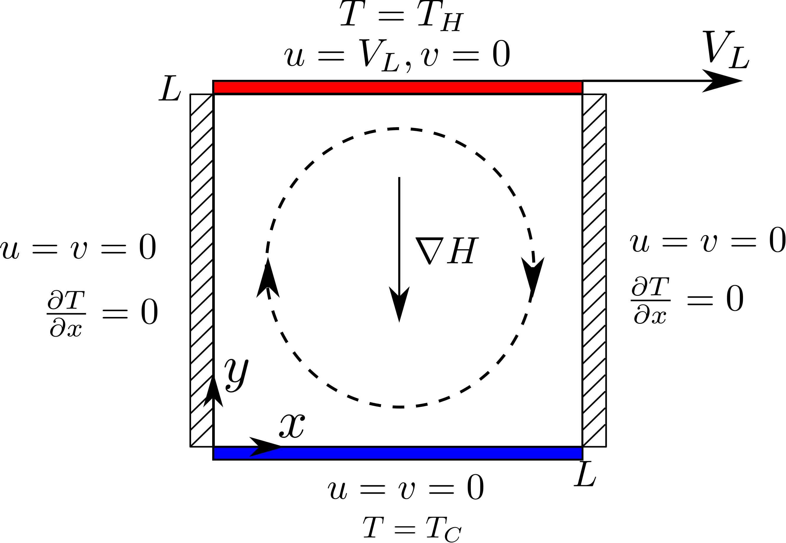
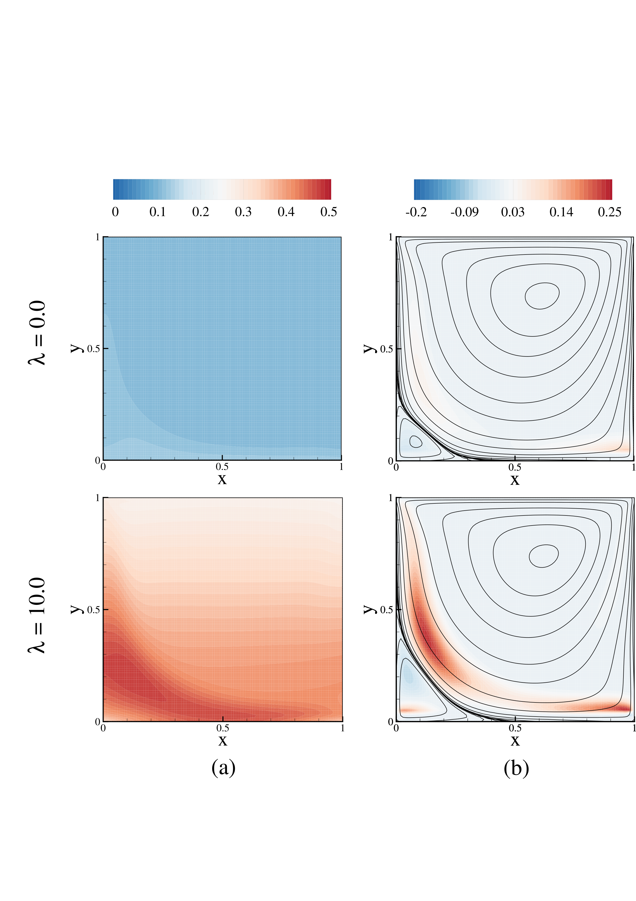
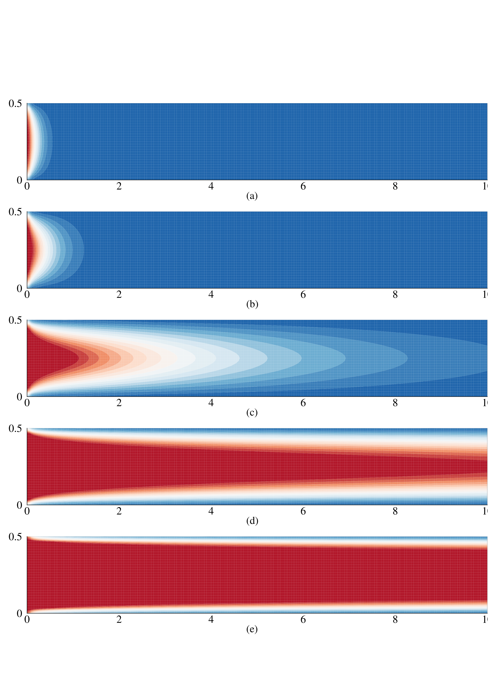

heatTransf_FHD is a CFD library for the study of steady-state two-dimensional problems in Ferrohydrodynamics subjected to heat transfer. 

# Physics

The governing equation system applied to this model is given by the hydrodynamic conservation laws expressed under the vorticity-stream function formulation with magnetic source terms. A phenomenological equation for the magnetization is adopted and the equilibrium magnetization is calculated up to concentrated regimes. The energy conservation equation is expressed in terms of the temperature equation. Detailed information regarding the theoretical model implemented is available in the associated publications section presented further down.

# Numerics

The numerical implementation is based on a Finite Volume Method (FVM) discretization of the governing equations applied to two-dimensional numerical domains. Both grid generation and solution scripts are writen in Python. Unstructured grids are generated for three geometries as an separate execution, and grid data is evoked based on domain leghts and grid volumes as user-inputs before the solution starts.

# Code structure

Cases for three numerical models are available, which share functions from pre to post-processing steps in three classical benchmark problems in CFD:

 - the Backward-Facing Step (BFS);

 

    
    
 

 - the Lid-Driven Cavity (LDC);

 - the Parallel Plates channel (PP).

 
Scripts for the grid generation are available in /grids. Grid volumes and domain lenghts must be set coincidently in both grid generation scripts ("/grids/[case]gridGen.py") as in the solution scripts ("./run[case].py").

A validation for the linear system iterative solution by the Conjugate Gradient Squared (CGS) method is presented against analytical solutions ("./validation_linAlgSolver.py"). The coupled governing equation system is solved in a segregated form under the pseudo-transient approach until the absolute error of all fields drops below a shared tolerance.  

# Associated publications

 - Alegretti, C. F., and R. G. Gontijo. "New insights on boundary layer control using magnetic fluids: A numerical study." Journal of Magnetism and Magnetic Materials 514 (2020): 167133.

 - Alegretti, C. F., and R. G. Gontijo. "A numerical study on the role of dipole interactions on the heat transfer rates in a ferrofluid shear flow." Journal of Magnetism and Magnetic Materials 587 (2023): 171243.

